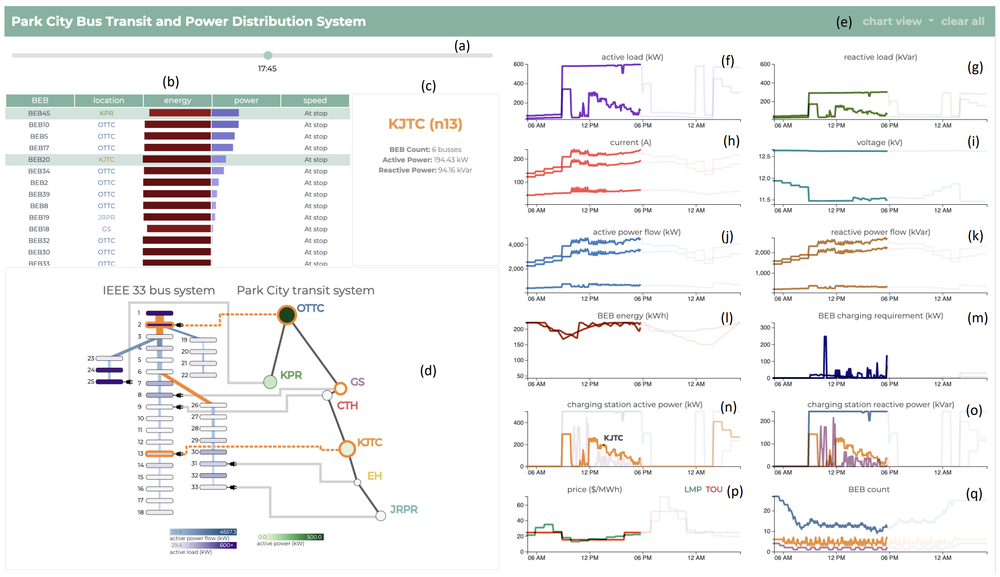

# pc-power-trans

Access here: https://usmart.ece.utah.edu/power-transit-vis/

Or here: https://mkcyoung.github.io/pc-power-trans/ 

[View the paper on arXiv.](https://arxiv.org/abs/2011.10917)

## A multi-network visualization and interactive tool for the power grid + bus transportation system in Park City, Utah. 

The high penetration of transportation electrification and its associated charging requirements magnify the interdependency of the transportation and power distribution systems. The emergent interdependency requires that system operators fully understand the status of both systems. To this end, a visualization tool is presented to illustrate the interdependency of battery bus transit and power distribution systems and the associated components. The tool aims at monitoring components from both systems, such as the locations of electric buses, the state of charge of batteries, the price of electricity, voltage, current, and active/reactive power flow. The results showcase the success of the visualization tool in monitoring the bus transit and power distribution components to determine a reliable cost-effective scheme for spatio-temporal charging of electric buses.

## Installation

The vis can be accessed through the above links. However, if you wish to run the vis from your own machine, download the repo then:

    $ cd path/to/pc-power-trans
    # for python 2
    $ python -m SimpleHTTPServer 8080
    # for python 3
    $ python -m http.server 8080

You can then view the web-vis at [http://localhost:8080](http://localhost:8080).

## Usage

### Features:
**(a)** A slider bar which controls the current time. All aspects of the vis update seamslessly in real time as the time bar changes. 
  
**(b)** The 45 BEBs in the bus transit system are visualized using
a scrollable table, in which the data items can be sorted
by clicking on the column headers. This table
lists BEBs’ velocities and locations for a given time, and
encodes the SOC of batteries and charging power requirements
using diverging bars colored by the respective energy and
power magnitude.    
  
**(c)** A data panel displays the
current data values associated with a system component; it
provides an interactive data display via linked-views
when an item in the table is hovered over in **(b)**,
when a user hovers over a line in the line charts **(f-q)**, and when a user hovers over the network componenets **(d)**.   
  
**(d)** The interdependant bus transit and power distribution systems. The power distribution system (left) is comprised of 33 nodes, where the
first node is the substation that is connected to an upstream
transmission network. The bus transit system consists of 7 bus stops with charging capabilities. The charging stations are connected to the power distribution nodes using gray lines.  
  
**(e)** The user is presented with 3 options for viewing the line charts: the line charts associated with the bus transit system, the line charts associated with the power distribution system, and all of the line charts combined.  
  
**(f-q)** The line charts associated with the various components of the power and transit systems. The line charts are populated based on user selection of the various componenets via the network (d) or the bus table (b).  

## Acknowledgements

This visualization grew out of a [class project](https://github.com/mkcyoung/power-trans-network) for CS 6965: Advanced Data Visualization taught by Bei Wang at the University of Utah. It was a multi-disciplinary effort with Avishan Bagherinezhad and Masood Parvania from the Department of Electrical and Computer Engineering at the University of Utah.  

